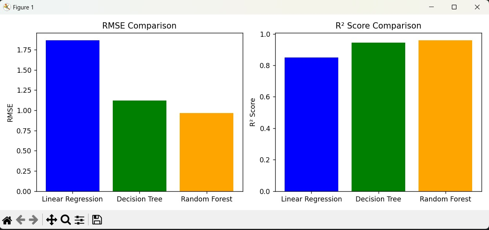

# Car Price Prediction Project

This project aims to predict the selling price of used cars based on various features such as age, fuel type, transmission, and more. The dataset used is included in this repository as `car data.csv`.

## Project Steps

1. **Data Loading and Exploration**
   - Loaded the dataset using pandas.
   - Explored the data for missing values and basic statistics.

2. **Data Preprocessing**
   - Created a new feature `Car_Age` from the year of the car.
   - Dropped irrelevant columns (`Car_Name`, `Year`).
   - Converted categorical variables to numeric using one-hot encoding.

3. **Feature and Target Selection**
   - Selected all relevant features as input (X).
   - Set `Selling_Price` as the target variable (y).

4. **Train-Test Split**
   - Split the data into training and testing sets (80% train, 20% test).

5. **Model Training and Evaluation**
   - Trained three different models:
     - Linear Regression
     - Decision Tree Regressor
     - Random Forest Regressor
   - Evaluated each model using RMSE (Root Mean Squared Error) and R² Score.

6. **Performance Visualization**
   - Compared the performance of all models using bar charts for RMSE and R² Score.

## Model Performance Comparison

Below is a comparison of the three models' performance:



- **Random Forest** performed the best with the lowest RMSE and highest R² Score.
- **Decision Tree** also performed well, while **Linear Regression** had higher error.

## How to Run

1. Install the required libraries:
   ```
   pip install pandas numpy matplotlib seaborn scikit-learn
   ```
2. Run the script:
   ```
   python Car_Price_Prediction.py
   ```

## Conclusion

This project demonstrates a complete machine learning workflow for regression tasks, including data preprocessing, model training, evaluation, and visualization. The Random Forest model is recommended for predicting car prices based on this dataset.

---

**Note:**  
Save the attached comparison image as `comparison.png` in your project folder for it to display in the README.